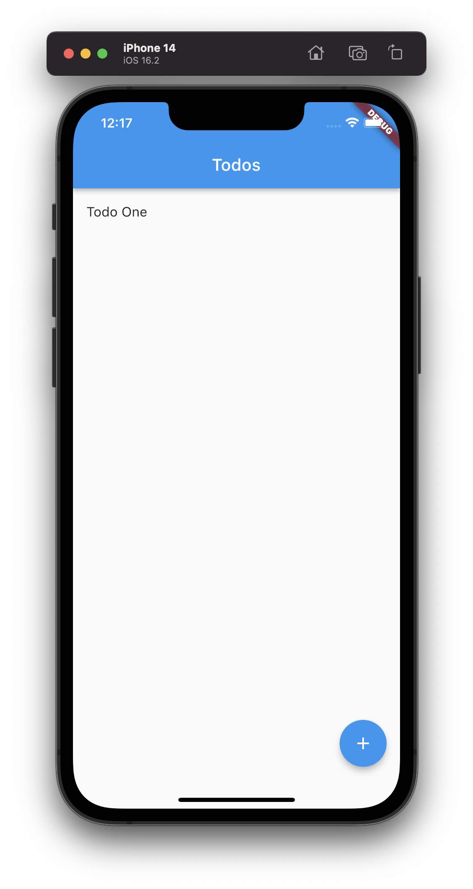
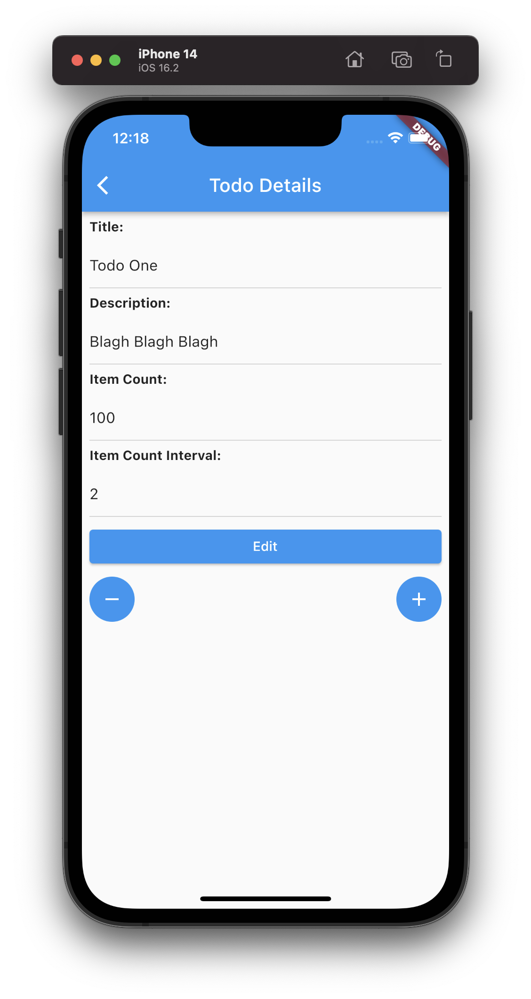

# list_app_flutter

An ios app built using flutter. It uses sqflite for persistance. 

## Features
- Create new tasks with a title, description, and item count, and item count interval.
- Edit task details including the title, description, item count, and item count interval.
- Mark tasks as completed or uncompleted.
- Increase or decrease the item count of a task.

## Installation

1. Clone the repository: `git clone https://github.com/your/repository.git`
2. Change to the project directory: `cd todo_app`
3. Install the dependencies: `flutter pub get`
4. Run the app: `flutter run`

## Screenshots 

## More info

Check these links out for information about flutter

- [Lab: Write your first Flutter app](https://docs.flutter.dev/get-started/codelab)
- [Cookbook: Useful Flutter samples](https://docs.flutter.dev/cookbook)

For help getting started with Flutter development, view the
[online documentation](https://docs.flutter.dev/), which offers tutorials,
samples, guidance on mobile development, and a full API reference.
 